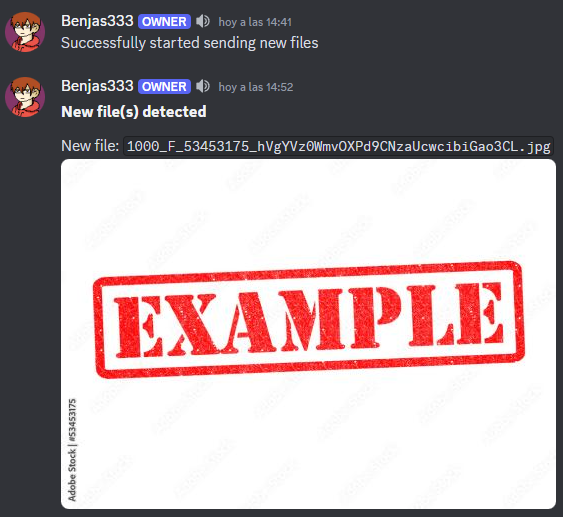
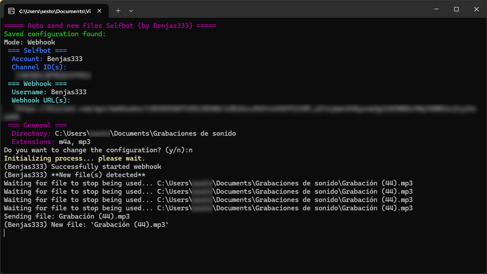

# Auto Send New Files Discord
Do you want to automatically send new files from a directory of your computer to a Discord Webhook? Well now you can with this code. Don't worry anymore about taking the time to search the file and sending it manually. This code will automatically do it for you.


> [!NOTE]
> Now Selfbot is available too.

## Official Releases
You can download the last official release [here](https://github.com/Benjas333/AutoSendNewFilesDiscord/releases/latest/).


> [!CAUTION]
> I don't know if it works properly in other operating systems than Windows.

## Cloning repo
### Getting Started
[Python 3.12](https://www.python.org/downloads/) recommended.
[Discord](https://discord.com/) lol.

### Clone this project
```
git clone https://github.com/Benjas333/AutoSendNewFilesDiscord
cd AutoSendNewFilesDiscord
```

### Install dependencies
```
pip install -r requirements.txt
```

### Configure the .env file
- Change the content of `example.env`.
- Rename it to `.env`.

## Usage
### Command line method
**`.env` file required.**

#### Webhook
```
python webhook.py
```

#### Selfbot
```
python selfbot.py
```
To use the selfbot you must provide your account token in the `.env` file.

`Ctrl + C` to stop the scripts.

### Import method
#### Webhook
```python
# Import script
from webhook import Webhook

webhook = Webhook(
        url=["https://your.discord.webhook/url", "https://another.discord.webhook/url"], # Set webhook url
        directory="C:\Your\Directory",
        extension="*", # '*' will check for all files in the directory
        recursive=True,
        seconds=0.5, # Default is 1 second
)
webhook.sendMessage("Hello, world!") # You can send simple messages!
webhook.loop()
```

#### Selfbot
```python
# Import script
from selfbot import Selfbot

client = Selfbot(
        channel_id=[1234567890, 987654321], # the channel id where you want to send the files
        directory="C:\Your\Directory",
        extension=["mp3", "m4a"],
        recursive=False,
        seconds=5
)
client.run(token="YOUR TOKEN HERE")
```
> [!IMPORTANT]
> If you want to use the `.env` file with the importing methods, you just need to make `import config`.

## TO DO
- Find an optimized way to send big files quickly.

## Changelog
- Added rate limit support for the Webhook mode.
- Added loop() method to Selfbot class and token as an init class argument.
- Added multiple extensions implementation for importing methods.
- Added multiple Discord channels implementation for importing methods.
- Added seconds argument (default: 1).
- Added Webhook class in `webhook.py`.
- Added create `old_clips.txt` functionality if the file does not exist. 
- Added [releases](https://github.com/Benjas333/AutoSendNewFilesDiscord/releases) for people not so familiar with programming in general.

## Contributing
Any contribution would be appreciated.

## Links
[Twitter](https://twitter.com/ElBenjas333)
